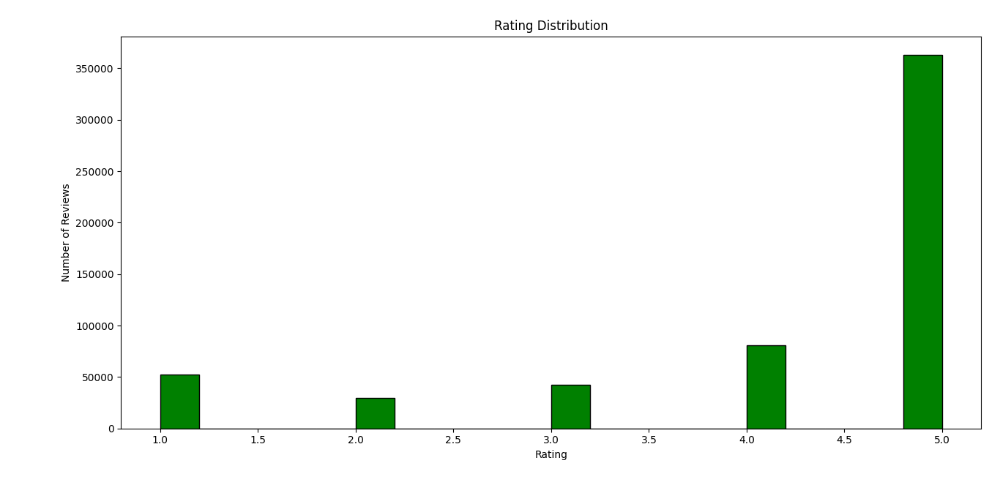
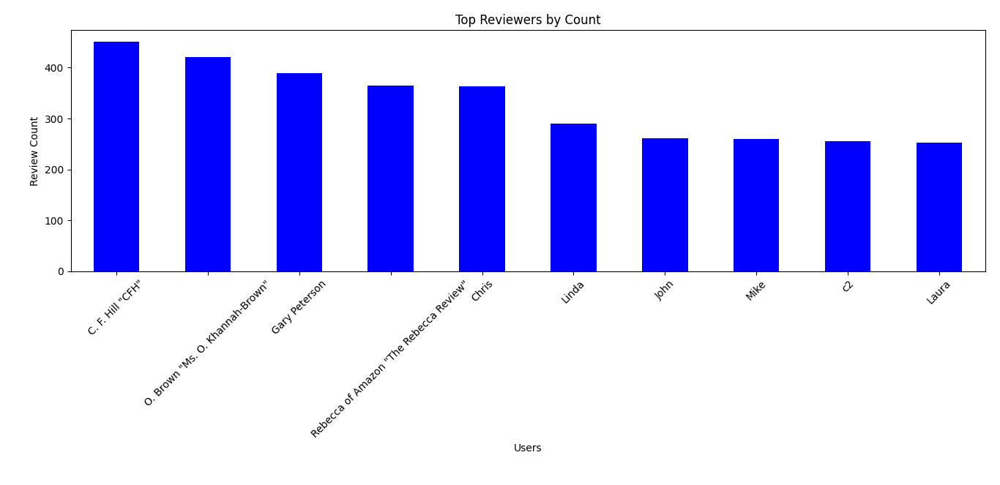

# 🛍️ E-commerce Review Analytics

Analyzed over 500K Amazon reviews to extract insights, detect sentiment, and identify patterns using Python.

Sentiment Summary (Polarity Stats):
count    568454.000000
mean          0.241591
std           0.224809
min          -1.000000
25%           0.106250
50%           0.231818
75%           0.371861
max           1.000000
Name: sentiment, dtype: float64
✅ Excel report saved as: ecommerce_analysis_report.xlsx

🔵 Top Reviewers:
ProfileName
C. F. Hill "CFH"                          451
O. Brown "Ms. O. Khannah-Brown"           421
Gary Peterson                             389
Rebecca of Amazon "The Rebecca Review"    365
Chris                                     363
Linda                                     290
John                                      261
Mike                                      260
c2                                        256
Laura                                     253
Name: count, dtype: int64

🟢 Most Helpful Reviews:
                     ProfileName                                       Summary  helpfulness_ratio
64421    J. E. Stephens "Jeanne"             Bought This for My Son at College                3.0
44736                        Ram  Pure cocoa taste with crunchy almonds inside                1.5
568407                  Spaceman          Premium Edge Dry Cat Food for Kitten                1.0
568408                      je2u                      Premium Edge Kitten Food                1.0
568409        Dark Water Mermaid                     Quality & affordable food                1.0
29                  Canadian Fan               The Best Hot Sauce in the World                1.0
32                     S. Potter                  Best of the Instant Oatmeals                1.0
33      Megan "Bad at Nicknames"                                  Good Instant                1.0
34                    CorbyJames     Great Irish oatmeal for those in a hurry!                1.0
35                    T. J. Ryan                                    satisfying                1.0

🔴 Top 5 Most Positive Reviews:
                                        Summary                                               Text  sentiment
486367  Caution: not for toy breeds or puppies!  We discovered this after receiving it and read...        1.0
568382                    Best buy 4 your money  I purchased a packet of the taco seasoning and...        1.0
84568             As Expected -- EXCELLENT TEA!  Luzianne tea makes, in my expert opinion, the ...        1.0
512463                                  yummmm!  I look forward to this coffee in the morning. ...        1.0
426509                              YUMMMMM!!!!  We have three darling Shitzus.  All of them ad...        1.0

⚫ Top 5 Most Negative Reviews:
                                           Summary                                               Text  sentiment
169401  They do not taste the same as they use to!  The Twizzlers do not taste like I remember the...       -1.0
368648                  Cherry cough syrup K-cups?  No apple flavor what so ever, has a horrible m...       -1.0
333553                                 Disgusting!  This tea tastes nasty.  Maybe I just dont like...       -1.0
484255                               Ribbon candy?  This crap showed up as candy FLAKES and in a m...       -1.0
66664                                    Lovely...  I wasn't going to write a review, though the p...       -1.0

## 📊 Features
- **Data Cleaning**: Removed duplicates and missing values
- **Sentiment Analysis**: Polarity scoring using TextBlob
- **Visualization**: Histogram, bar chart for ratings and top reviewers
- **Helpful Reviews**: Ranked based on helpfulness ratio
- **Excel Export**: Auto-generates summary report

## 📁 Folder Structure
main.py # Main script
data_loader.py # Loads dataset
cleaner.py # Cleans data
analyzer.py # Performs analytics
sentiment.py # Analyzes sentiment
visualizer.py # Plots graphs
utils.py # Exports to Excel
ecommerce_analysis_report.xlsx # Output report
.gitignore
README.md

## 💻 Tech Stack
- Python
- Pandas
- Matplotlib
- TextBlob
- Excel Export

## 🚫 Note
The original dataset (`amazon.csv`) is too large for GitHub and has been excluded. You can [download it here](https://www.kaggle.com/datasets/datafiniti/consumer-reviews-of-amazon-products) and place it in the `data/` folder.

---

## 📸 Sample Visuals



---

## 📌 Run Locally

```bash
pip install -r requirements.txt
python main.py
📩 Contact
Mo Moin
📧 momoin737@gmail.com
📱 +91-7518169839
🔗 LinkedIn
🔗 Portfolio


